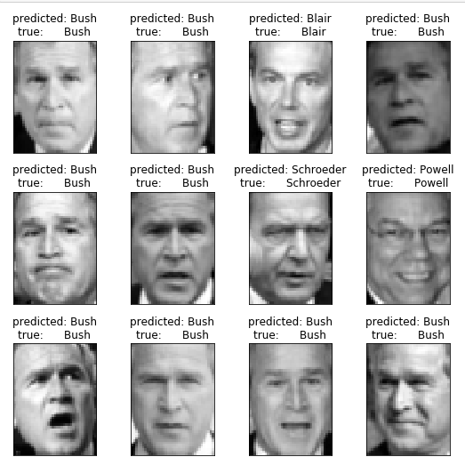

# Application on : Unsupervised Learning
## Faces recognition example using eigenfaces and SVMs
### The dataset used in this example is a preprocessed excerpt of the "Labeled Faces in the Wild", aka LFW_ Download (233MB)
#### sample input and output:

Avg/accuracy is : 84%
